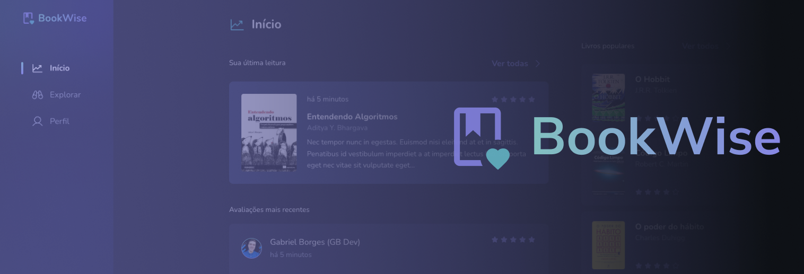
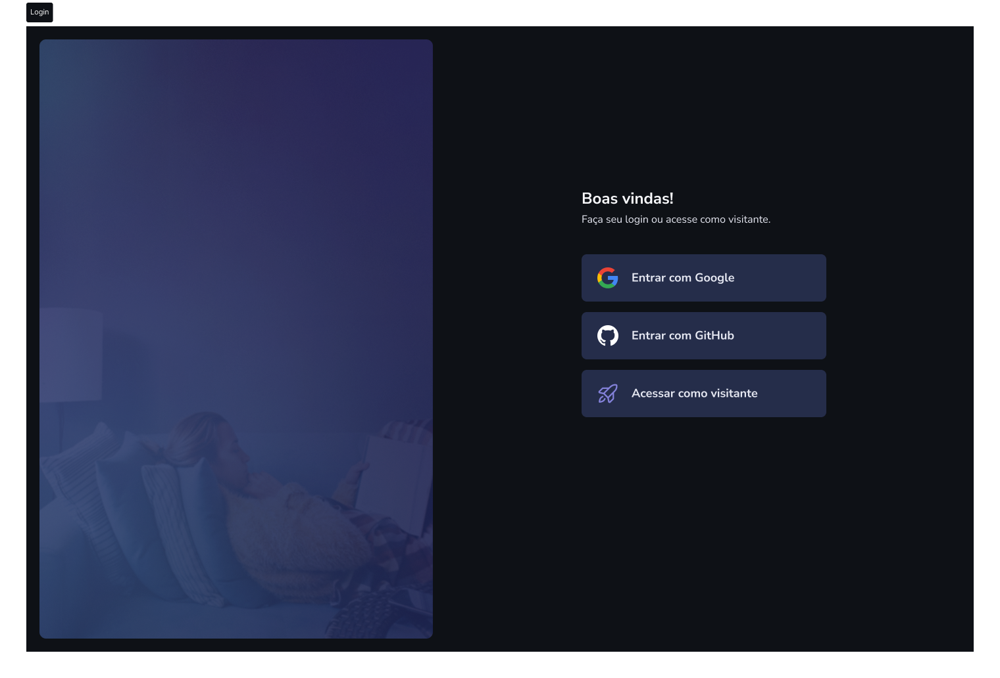

<p align="center">
  
  
  <a href="https://github.com/jsnevt/README-bookwise/commits/master">
    
  </a>
    
   
   <a href="https://github.com/jsnevt/README-bookwise/stargazers">
    
  </a>

  <a href="https://rocketseat.com.br">
    
  </a>
  
  <a href="https://blog.rocketseat.com.br/">
    
    </a>
</p>

<h1 align="center">
    
</h1>

<h4 align="center"> 
	🚧  Bookwise ♻️ Concluído 🚀 🚧
</h4>

<p align="center">
 <a href="#-sobre-o-projeto">Sobre</a> •
 <a href="#-funcionalidades">Funcionalidades</a> •
 <a href="#-layout">Layout</a> • 
 <a href="#-como-executar-o-projeto">Como executar</a> • 
 <a href="#-tecnologias">Tecnologias</a> • 
 <a href="#-contribuidores">Contribuidores</a> • 
 <a href="#-autor">Autor</a> • 
 <a href="#user-content--licença">Licença</a>
</p>

## 💻 Sobre o projeto

Bookwise - é uma plataforma de avaliação livros, onde o usuário pode fazer login com Google ou Github e então avaliar livros facilmente.

Projeto Full-stack desenvolvido durante o curso online oferecido pela [Rocketseat].

---

## ⚙️ Funcionalidades

- [x] Pessoas podem se cadastrar na plataforma web usando seu login social da Google ou do Github.
	- Possibilidade de buscar livros
	- Listar por categorias
	- Avaliar livros
	- Dentro do perfil, poderá acompanhar quantidade de páginas lidas, autores lidos e avaliações
	- Ver livros populares

---

## 🎨 Layout

O layout da aplicação está disponível no Figma:

<a href="https://www.figma.com/file/Bki8vWa3vXB5xS0Xz5HNBk/BookWise-(Copy)?type=design&node-id=1-17&mode=design&t=m71ShmJi9tCrooOZ-0">
  
</a>


### Web

<p align="center" style="display: flex; align-items: flex-start; justify-content: center;">
  

  
</p>

---

## 🚀 Como executar o projeto

O projeto foi feito usando o framework Next.js com React 


### Pré-requisitos

Antes de começar, você vai precisar ter instalado em sua máquina as seguintes ferramentas:
[Git](https://git-scm.com), 
[Node.js](https://nodejs.org/en/). 
Além disto é bom ter um editor para trabalhar com o código como [VSCode](https://code.visualstudio.com/)


#### 🧭 Rodando a aplicação web (Frontend / Backend)

```bash

# No prompt de comando:
# Crie uma pasta onde desejar
# Acesse a pasta e no terminal

# Clone este repositório
$ git clone https://github.com/jsnevt/bookwise.git

# Instale as dependências
$ npm install

# No VSCode, abra a pasta onde o arquivo foi clonado e abra o projeto

$ Crie um arquivo .env na raíz e adicione a seguinte expressão no arquivo: (DATABASE_URL='file:./dev.db') - sem os parenteses
# A aplicação precisa que o Prisma receba essa informação para fazer a comunicação com o banco de dados, caso contrário, dará erro.
$ Salve.

# Acesse o terminal do VS e execute a aplicação em modo desenvolvimento
$ Digite "num run dev" (sem as aspas)

A aplicação será aberta na porta:3000 - acesse http://localhost:3000

```
---

## 🛠 Tecnologias

As seguintes ferramentas foram usadas na construção do projeto:

#### **Website**  ([React](https://reactjs.org/)  +  [TypeScript](https://www.typescriptlang.org/))

-   **[Phosphor-Icons](https://phosphoricons.com)**
-   **[Axios](https://github.com/axios/axios)**
-   **[Radix-UI](https://www.radix-ui.com)**
-   **[Stithces](https://stitches.dev/)**
-   **[Tanstack-React-Query](https://tanstack.com/query/latest)**


**Server**  ([NodeJS](https://nodejs.org/en/)  +  [TypeScript](https://www.typescriptlang.org/))

-   **[Next](https://nextjs.org)**
-   **[Next-Auth](https://next-auth.js.org)**
-   **[TypeScript](https://www.typescriptlang.org)**
-   **[Zod](https://zod.dev/)**
-   **[Prisma](https://www.prisma.io)**


> Veja o arquivo  [package.json](https://github.com/JsnEvt/Bookwise/blob/main/package.json)

## 💪 Como contribuir para o projeto

1. Faça um **fork** do projeto.
2. Crie uma nova branch com as suas alterações: `git checkout -b my-feature`
3. Salve as alterações e crie uma mensagem de commit contando o que você fez: `git commit -m "feature: My new feature"`
4. Envie as suas alterações: `git push origin my-feature`
> Caso tenha alguma dúvida confira este [guia de como contribuir no GitHub](./CONTRIBUTING.md)

---

## 🦸 Autor

[](https://www.linkedin.com/in/jason-everton-041226223/)

[](mailto:jasonemsw10@gmail.com)


## 📝 Licença

Este projeto esta sobe a licença [MIT](./LICENSE).

Feito com ❤️ por Thiago Marinho 👋🏽 [Entre em contato!](https://www.linkedin.com/in/jsnevt/)

---


